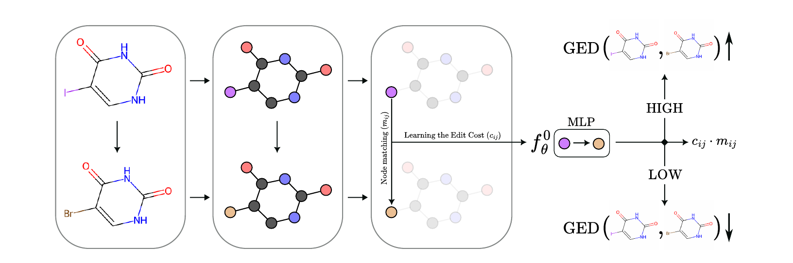
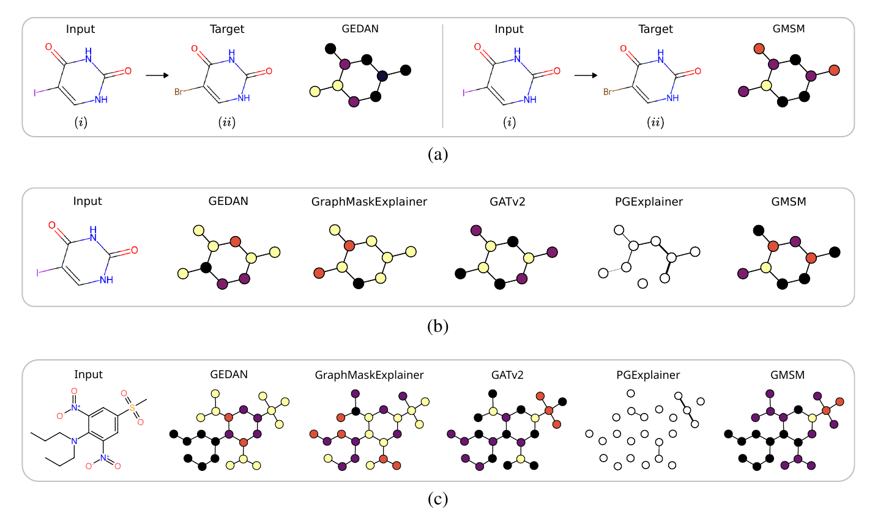

# GEDAN: Learning the Edit Costs for Graph Edit Distance

This repository contains the code for the anonymous submission **"GEDAN: Learning the Edit Costs for Graph Edit Distance"**. The project introduces an interpretable GNN framework for approximating Graph Edit Distance (GED) through context-aware edit cost learning, applicable in both supervised and unsupervised settings, and effective for molecular analysis.


---

## Visual Comparison Example

The figure below shows an example of molecular analysis generated by GEDAN. Lighter colors indicate high relevance, while darker colors represent low or no relevance.



To reproduce the image, use the following commands:

```
python script_Mol.py --input 2 --target 3
python script_Mol.py --input 2 --target all
python script_Mol.py --input 61 --target all
```

Other comparisons can be made by providing the indices of the molecules located in the *molecules* folder.

---

## How to Use GEDAN

### Installation

Clone the repository and install the required dependencies:

```bash
pip install -r requirements.txt
```

### Training

The following commands can be used to train models for the Edit Cost (EC) and Graph Edit Distance (GED) tasks:

#### Edit Cost (EC) task
```
python scripts/train.py --type EC --dataset <DATASET>
```
Where:
- `<DATASET>` can be: `BBBP` or `FreeSolv`.

#### Graph Edit Distance (GED) task
```
python scripts/train.py --type GED --dataset <DATASET> --model <MODEL> [--idx_costs <INDEX>]
```
Where:
- `<DATASET>` can be: `AIDS`, `MUTAG`, or `PTC_MR`.
- `<MODEL>` can be: `UGEDAN` or `SGEDAN`.
- `[--idx_costs]` is optional and accepts integer values from `0` to `4`.

---

## How to Verify Results

### GED results
To verify the GED results, use:

```
python script_GED.py --dataset <DATASET> --model <TYPE>
```
Where:
- `<DATASET>` can be: `AIDS`, `MUTAG`, or `PTC_MR`.
- `<TYPE>` can be: `U` for UGEDAN or `S` for SGEDAN.

Example:
```
python script_GED.py --dataset MUTAG --model S
```

### EC results
To verify the EC results, use:

```
python script_EC.py --dataset <DATASET> [--inference <TYPE>]
```
Where:
- `<DATASET>` can be: `BBBP` or `FreeSolv`.
- `<TYPE>`  is optional, True for generator embeddings.

Example:
```
python script_EC.py --dataset FreeSolv
```

